# Audio Notes Platform 🎙️

Welcome to the **Audio Notes Platform**! This is a full-stack web application that allows users to upload audio files of any length, transcribes them using the **Gnani ASR API**, and generates a concise summary using the **Google Gemini API**. 

The platform is designed to be fully asynchronous, beautifully animated, and highly robust to handle real-world API constraints.

---

## 🏗️ 1. System Architecture

The application is split into a **Next.js (React)** frontend and a **FastAPI (Python)** backend, communicating via REST APIs. When a user uploads a file, the backend saves it and immediately responds. The heavy lifting (transcription and summarization) happens in background tasks, while the frontend polls for updates.

```mermaid
sequenceDiagram
    participant User
    participant Frontend as Next.js UI
    participant Backend as FastAPI Server
    participant DB as SQLite DB
    participant Gnani as Gnani ASR API
    participant Gemini as Gemini AI API

    User->>Frontend: Upload Audio File (.m4a, .wav)
    Frontend->>Backend: POST /api/notes/upload
    Backend->>DB: Create Note (Status: "pending")
    Backend-->>Frontend: Return Note ID (200 OK)
    
    rect rgb(20, 20, 30)
    Note over Backend,Gemini: Background Processing Task
    Backend->>DB: Update Status to "uploading"
    Backend->>Backend: Chunk Audio (25s segments)
    Backend->>Gnani: Transcribe Chunks (with retries)
    Gnani-->>Backend: Return Transcript
    Backend->>DB: Update Status to "summarizing"
    Backend->>Gemini: Generate Summary
    Gemini-->>Backend: Return Summary
    Backend->>DB: Update Status to "completed"
    end
    
    loop Every 2 Seconds
        Frontend->>Backend: GET /api/notes/{id}
        Backend-->>Frontend: Return Current Status
        Frontend-->>User: Update UI Progress Bar
    end
```



---

## 🧠 2. Core Concepts & Code Walkthrough

In this section, we'll explain the fundamental software engineering concepts used in this project before diving into the code that implements them.

### A. Concept: Asynchronous Background Processing
**What is it?** When a user uploads a 5-minute audio file, transcribing and summarizing it might take 60 seconds. If the backend made the user wait for 60 seconds without responding, the browser would likely time out. Background processing means the server accepts the file, says "I got it!", and then processes the file in the background without keeping the user waiting on the initial request.

**How it's implemented:**
We use FastAPI's `BackgroundTasks` feature.
```python
# backend/app/routes/notes.py (Simplified)
@router.post("/upload")
async def upload_audio(
    background_tasks: BackgroundTasks,
    file: UploadFile,
    db: AsyncSession
):
    # 1. Save the file to disk
    file_path = await save_upload_file(file)
    
    # 2. Create database entry
    note = AudioNote(title=file.filename, status=NoteStatus.pending)
    db.add(note)
    await db.commit()
    
    # 3. Schedule the background task
    background_tasks.add_task(process_audio_note, note.id, file_path)
    
    # 4. Return immediately to the user!
    return {"message": "Upload successful, processing started", "id": note.id}
```

### B. Concept: Audio Chunking & Exponential Backoff
**What is it?** APIs often have limits. For instance, an API might only accept 30 seconds of audio at a time, or it might rate-limit you if you send too many requests too fast. "Chunking" means dividing a large file into smaller pieces. "Exponential Backoff" means if the API rejects a request (e.g., "Too Many Requests"), you wait a little bit (3 seconds), try again, and if it fails, wait longer (6 seconds, 12 seconds), rather than spamming the API.

**How it's implemented:**
We use `pydub` to slice the audio and a loop to implement retries for the Gnani ASR API.
```python
# backend/app/services/transcription.py (Simplified)
async def transcribe_chunk(client, chunk_path, headers):
    for attempt in range(6): # Retry up to 6 times
        response = await client.post(gnani_api_url, headers=headers, files=...)
        
        # If rate limited (429 status code)
        if response.status_code == 429:
            wait_time = 3 * (2 ** attempt) # Waits 3s, 6s, 12s...
            await asyncio.sleep(wait_time)
            continue # Try again!
            
        return response.json()["transcript"]

async def transcribe_audio(file_path: str):
    # 1. Load audio and chunk into 25-second pieces
    audio = AudioSegment.from_file(file_path)
    chunk_length_ms = 25 * 1000 
    chunks = [audio[i:i + chunk_length_ms] for i in range(0, len(audio), chunk_length_ms)]
    
    # 2. Process chunks
    full_transcript = []
    for chunk in chunks:
        # Export temporary file
        chunk.export("temp.wav", format="wav")
        # Transcribe with retries
        text = await transcribe_chunk("temp.wav")
        full_transcript.append(text)
        
    return " ".join(full_transcript)
```

### C. Concept: Frontend Polling
**What is it?** Since the backend is processing the audio in the background, the frontend doesn't know when it's done. "Polling" is a technique where the frontend repeatedly asks the backend, "Are you done yet?" every few seconds until the job is complete.

**How it's implemented:**
We use a React `useEffect` combined with `setInterval` to fetch the note status every 2 seconds.
```typescript
// frontend/src/app/notes/[id]/page.tsx (Simplified)
useEffect(() => {
    const fetchNote = async () => {
      const data = await noteApi.getNote(id);
      setNote(data);
      
      // Stop polling if completed or failed
      if (data.status === 'completed' || data.status === 'failed') {
        setIsPolling(false);
      }
    };

    fetchNote(); // Fetch immediately

    // Set up polling every 2 seconds
    let intervalId: NodeJS.Timeout;
    if (isPolling) {
      intervalId = setInterval(fetchNote, 2000);
    }

    // Cleanup interval when component unmounts
    return () => clearInterval(intervalId);
}, [id, isPolling]);
```

---

## 🚧 3. Challenges Faced & Solutions

Building this platform wasn't without hurdles. Here are the major problems encountered and how we solved them:

### Challenge 1: The Gnani API 30-Second Limit
**The Problem:** We wanted users to be able to upload long meetings or voice notes, but testing revealed that the Gnani REST API throws a `400 Bad Request` with the error `"Audio duration exceeds maximum allowed duration of 30 seconds"`.
**The Solution:** We implemented **Audio Chunking**. By leveraging `ffmpeg` and Python's `pydub` library, the backend intercepts the file, measures its length, and seamlessly slices it into safe 25-second chunks before sending them to Gnani sequentially.

### Challenge 2: Python 3.14 Compatibility vs. Audio Libraries
**The Problem:** The `pydub` library relies heavily on a built-in Python module called `audioop`. However, the user environment was running Python 3.14. Google/Python officially removed `audioop` starting in Python 3.13, causing the backend to completely crash with a `ModuleNotFoundError` during processing.
**The Solution:** We identified that an open-source bridge called `audioop-lts` exists to restore this functionality in newer Python versions. We ran `pip install audioop-lts`, updated the `requirements.txt`, and restored full functionality without having to rewrite the chunking engine from scratch.

### Challenge 3: Gemini Model Deprecation & 404 Errors
**The Problem:** We initially configured the AI summarization to use `gemini-1.5-flash` or `gemini-pro`. However, the older SDK version installed in the backend threw a `404 Not Found` error, stating that `gemini-pro` was unsupported in the `v1beta` endpoint and no longer available.
**The Solution:** We wrote a custom diagnostic script on the server to query the exact list of available models via `genai.list_models()`. We discovered that Google had forcefully migrated to the 2.5 and 3.0 lines. We updated our configuration to dynamically target `gemini-3.8-flash` (and subsequently verified `gemini-2.5-flash`), instantly fixing the summarization pipeline.

### Challenge 4: API Rate Limiting (HTTP 429)
**The Problem:** Because we broke long audio files into dozens of 25-second chunks and uploaded them quickly, the Gnani API interpreted this as an attack and returned `HTTP 429: Rate Limit Exceeded`, leaving holes in our transcript.
**The Solution:** We wrapped the API call in an **Exponential Backoff** loop. If the server receives a `429`, it waits 3 seconds, tries again. If it fails again, it waits 6 seconds, then 12 seconds. This perfectly paced the requests to respect Gnani's bandwidth rules while still transcribing the whole file.
